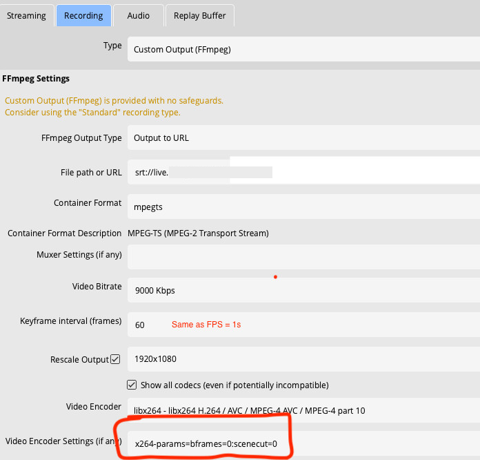

### Prerequisites

- [OBS Studio](https://obsproject.com/download) installed on your computer
- An AT Protocol account (same as your Bluesky account) for logging in to
  Streamplace
- Web browser

## Basic Setup Instructions

### 1. Get your Stream Key from Streamplace

1. Open your web browser
2. [Visit Streamplace](https://stream.place) and log in to your account
3. Navigate to the Live Dashboard
4. Click "Stream from OBS"
5. Select either `RTMP` (preferred) or `WHIP`.
6. Click "Generate Stream Key"
   - The stream key will automatically be copied to your clipboard

### 2. Configure OBS Studio <a name="obs-configuration"></a>

#### 2a. Initial OBS Configuration

1. Launch OBS Studio
2. Navigate to Settings > Stream

#### 2b. Stream Settings

1. Return to OBS Settings > Stream
2. Configure the following:
   - Service:
     - If using `RTMP`, select `Custom...`.
     - If using `WHIP`, select `WHIP`.
   - Server:
     - If using `RTMP`: `rtmps://stream.place:1935/live`
     - If using `WHIP`: `https://stream.place`
   - Stream Key (for RTMP) or Bearer Token (for WHIP): _Paste your copied stream
     key_

#### 2c. Output Configuration

1. Go to OBS Settings > Output
2. Configure these settings:
   - Output Mode: Select "Advanced" from dropdown
   - Navigate to Streaming Tab

#### 2d. Streaming Settings

- Audio Encoder:
  - For `RTMP`, choose an appropriate AAC encoder.
  - For `WHIP`, use `ffmpeg_opus`.
  - If you are using a server that supports the SRT protocol (e.g.
    multistreaming via NGINX) please check below for an example config.
- Video Encoder: _(Select appropriate encoder, e.g. libx264/nvenc_h264)_

#### 2e. Suggested Video Encoder Settings

- Video Encoder: x264/h264 (**must** be an x/h.264 encoder)
- Rate Control: `CBR`
- Keyframe Interval: `1s` (or anything less than once every ~7s)
  - This is _one keyframe per second_
  - In some situations (e.g. 'keyframe interval (**frames**)'), this should be
    set to your FPS.
- x264 Options: `bframes=0`
  - If available, there also may be a 'bframes' checkbox which should **NOT** be
    checked

:::caution
These last two options are very important! Your viewers' experience may be choppy or otherwise subpar if you don't have them correct.
:::

### 3. Announce your stream

1. Once you're live, go back to the live dashboard.
2. There, you can fill out your stream title and choose an optional thumbnail.
3. Click 'Announce Livestream' to announce your livestream to the world!

## Multitrack Video (Enhanced RTMP)

Streamplace supports eRTMP multitrack ingest: OBS encodes several renditions
of your stream (for example 1080p and 720p) and sends them over a single RTMP
connection. Viewers can then switch between your renditions, and since you're
sending the ladder yourself, no server-side video transcode is needed.

Requires OBS Studio ≥ 31.0.0.

1. Open Settings > Stream
2. Service: `Custom...`, Server: `rtmps://stream.place:1935/live`, Stream Key:
   _your stream key_
3. Turn on `Enable Multitrack Video`
4. Leave `Maximum Streaming Bandwidth` and `Maximum Video Tracks` on `Auto`
5. Turn on `Enable Config Override` and fill `Config Override (JSON)`, for
   example:

```json
{
  "encoder_configurations": [
    {
      "type": "obs_x264",
      "width": 1920,
      "height": 1080,
      "framerate": { "numerator": 30, "denominator": 1 },
      "settings": {
        "rate_control": "CBR",
        "bitrate": 6000,
        "keyint_sec": 1,
        "preset": "veryfast",
        "profile": "high",
        "tune": "zerolatency"
      },
      "canvas_index": 0
    },
    {
      "type": "obs_x264",
      "width": 1280,
      "height": 720,
      "framerate": { "numerator": 30, "denominator": 1 },
      "settings": {
        "rate_control": "CBR",
        "bitrate": 3000,
        "keyint_sec": 1,
        "preset": "veryfast",
        "profile": "main",
        "tune": "zerolatency"
      },
      "canvas_index": 0
    }
  ],
  "audio_configurations": {
    "live": [
      {
        "codec": "ffmpeg_aac",
        "track_id": 1,
        "channels": 2,
        "settings": { "bitrate": 160 }
      }
    ]
  }
}
```

A few constraints specific to Streamplace:

- Every video track must be **H.264** (`obs_x264`, `obs_nvenc_h264_tex`,
  `h264_texture_amf`, or `obs_qsv11_v2`). HEVC/AV1 multitrack is not yet
  supported.
- Send a **single AAC audio track** — multitrack audio is not supported.
- Keep `keyint_sec` **identical on all tracks** (1s recommended, same as the
  single-track guidance above) so the renditions stay keyframe-aligned.

## Multi-Streaming Support

OBS supports multi-streaming through two available OBS plugins:

1. **OBS Resources - Multiple RTMP Outputs**

   - [GitHub Releases - obs-multi-rtmp](https://github.com/sorayuki/obs-multi-rtmp/releases)
   - [OBS Multistreaming Guide](guides/obs-multistreaming)

2. [**Aitum Multistream Plugin**](https://aitum.tv/products/multi)

Alternatively, you can
[multistream through Streamplace itself.](/docs/features/multistreaming)

## Best Practices

- Test your stream settings before going live
- Monitor your stream health during broadcasts
  - If you see lots of dropped frames, lower your bitrate.
- Ensure stable internet connection
- Keep your OBS software updated

## Additional Resources

- [OBS Official Documentation](https://obsproject.com/docs/)

### Example Settings



> Multistreaming via a server that supports the SRT protocol
